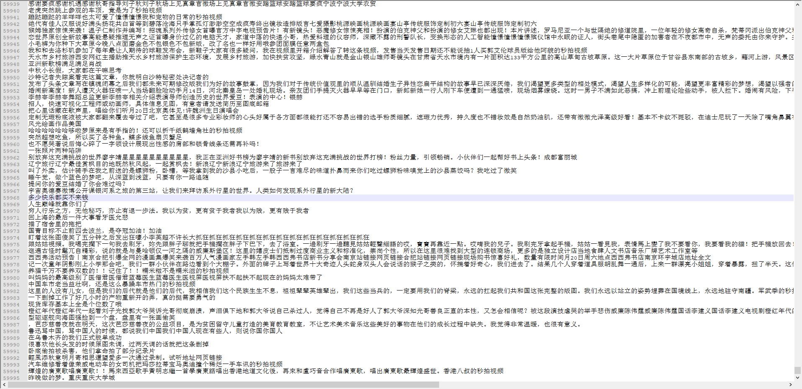
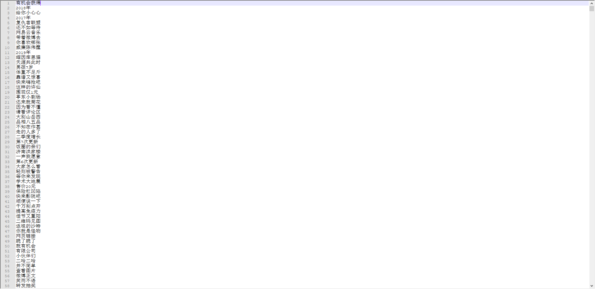

# **pyUnit-NewWord** [][1]

## 无监督训练文本词库
[](https://pypi.org/project/pyunit-newword/)

## 安装
    pip install pyunit-newword
    
## 注意事项
    该算法采用Hash字典存储，大量消耗内存。100M的纯中文文本需要12G以上的内存，不然耗时太严重。

## 更新说明
    新增加自动识别新词模型，无需手动设置参数

## 训练代码非模型(文本是UTF-8格式)
```python
from pyunit_newword import NewWords

if __name__ == '__main__':
    nw = NewWords(filter_cond=10, filter_free=2)
    nw.add_text(r'C:\Users\Administrator\Desktop\微博数据.txt')
    nw.analysis_data()
    with open('分析结果.txt', 'w', encoding='utf-8')as f:
        for word in nw.get_words():
            print(word)
            f.write(word[0] + '\n')
```

## 无监督训练新词模型
```python
from pyunit_newword import NewWords

if __name__ == '__main__':
    nw = NewWords(accuracy=0.01)
    nw.add_text(r'C:\Users\Administrator\Desktop\微博数据.txt')
    nw.analysis_data()
    with open('分析结果.txt', 'w', encoding='utf-8')as f:
        for word in nw.get_words():
            print(word)
            f.write(word[0] + '\n')
```

## 微博数据下载
[点击下载微博数据](http://cdn.tyoui.cn/微博数据.7z)

## 爬虫的微博数据一部分截图（大概100M纯文本）


## 训练微博数据后的结果


### 训练后得到的词语视频
[](https://youtu.be/6PSM4dMArGo "YouTube视频")

### 算法实现来源
[基于改进互信息和邻接熵的微博新词发现方法](http://xueshu.baidu.com/usercenter/paper/show?paperid=b31a76cd03eebaaa598faa3f904770b8)

# TODO
- [x] ~~自动寻找过滤参数~~
- [ ] 参数自动寻找最优解

***
[1]: https://blog.jtyoui.com
